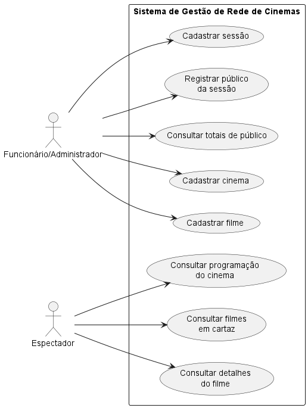
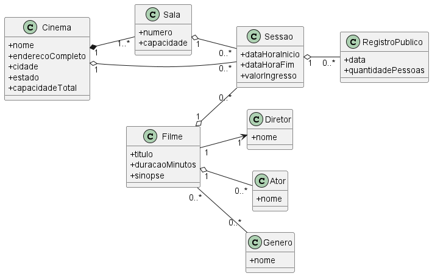
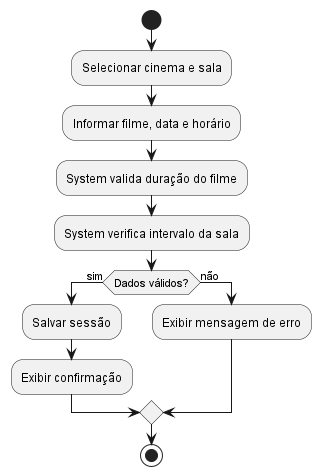
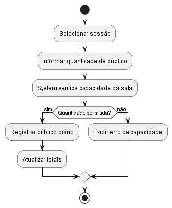
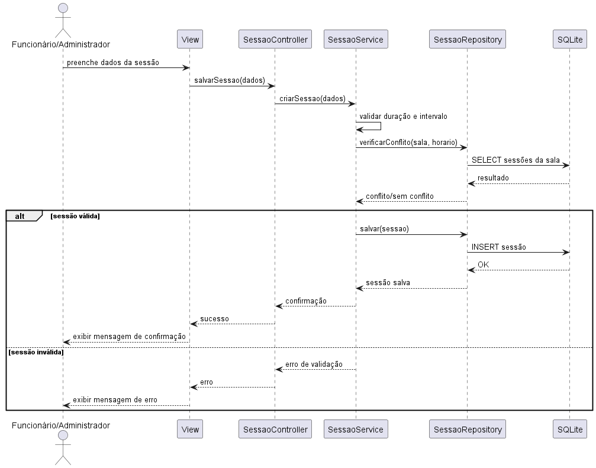
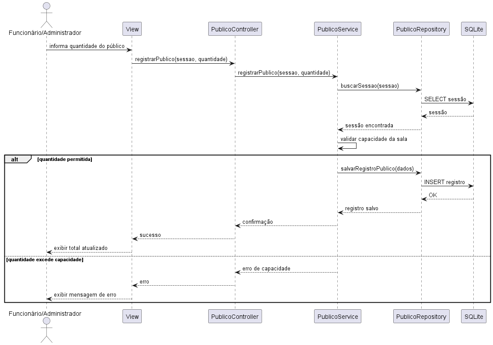

# Engenharia de Software – Caso Rede de Cinemas

## 1. Contextualização

Uma empresa atua como rede de cinemas, possuindo diversas unidades espalhadas por diferentes cidades e estados. Cada cinema possui características próprias, como capacidade de público e endereço completo, e exibe simultaneamente vários filmes em cartaz, organizados em sessões ao longo do dia.

O cenário apresenta a necessidade de centralizar e organizar as informações da rede, garantindo consistência, rastreabilidade e facilidade de evolução.

## 2. Objetivo da Atividade

Modelar, de forma enxuta, um sistema de informação para a rede de cinemas, contemplando:

- requisitos funcionais principais;
- regras de negócio essenciais;
- diagramas UML coerentes entre si;
- organização visual da solução proposta.

## 3. Requisitos Funcionais Principais

### RF01 – Cadastrar cinema
Permitir o cadastro de cinemas da rede com nome, endereço e capacidade.

### RF02 – Cadastrar filme
Permitir o cadastro de filmes com título, gênero, duração, elenco e diretor.

### RF03 – Cadastrar sessão
Permitir o cadastro de sessões associadas a um cinema, filme, data e horário.

### RF04 – Consultar filmes em cartaz
Permitir visualizar os filmes exibidos em um cinema específico.

### RF05 – Consultar sessões
Permitir consultar sessões por cinema, filme ou data.

### RF06 – Registrar público da sessão
Permitir registrar a quantidade de espectadores presentes em uma sessão.

### RF07 – Consultar totalizações
Permitir consultar o total de público por sessão, por filme e por cinema.

## 4. Regras de Negócio Essenciais

### RN01
Cada cinema deve possuir nome, endereço completo e capacidade máxima de público.

### RN02
Cada filme deve possuir título, duração, gênero, elenco e diretor.

### RN03
Uma sessão deve estar vinculada a um único filme e a um único cinema.

### RN04
Uma sessão deve possuir data, horário de início e horário de término calculado a partir da duração do filme e de um intervalo mínimo.

### RN05
O público registrado em uma sessão não pode ultrapassar a capacidade da sala/cinema vinculada à sessão.

### RN06
O total de público de um filme deve ser obtido pela soma das sessões associadas a ele.

### RN07
O total de público de um cinema deve ser obtido pela soma das sessões realizadas naquele cinema.

### RN08
As informações de elenco, diretor e gênero devem ser mantidas para consulta e organização dos filmes.

## 5. Diagramas

### 5.1 Diagrama de Casos de Uso

### 5.2 Diagrama de Classes do Domínio

### 5.3 Diagrama de Atividade – Cadastrar Sessão

### 5.4 Diagrama de Atividade – Registrar Público

### 5.5 Diagrama de Sequência – Cadastrar Sessão

### 5.6 Diagrama de Sequência – Registrar Público

## 6. Observações

A proposta foi estruturada de forma simples e coerente com o escopo da disciplina, priorizando a integração entre requisitos, regras de negócio e modelagem UML.

A organização dos arquivos segue a seguinte estrutura:

- `docs/` → documentação textual;
- `diagrams/` → imagens dos diagramas;
- `uml/` → arquivos `.puml` dos diagramas;
- `estrutura-do-repositorio.txt` → visão geral da estrutura do repositório.